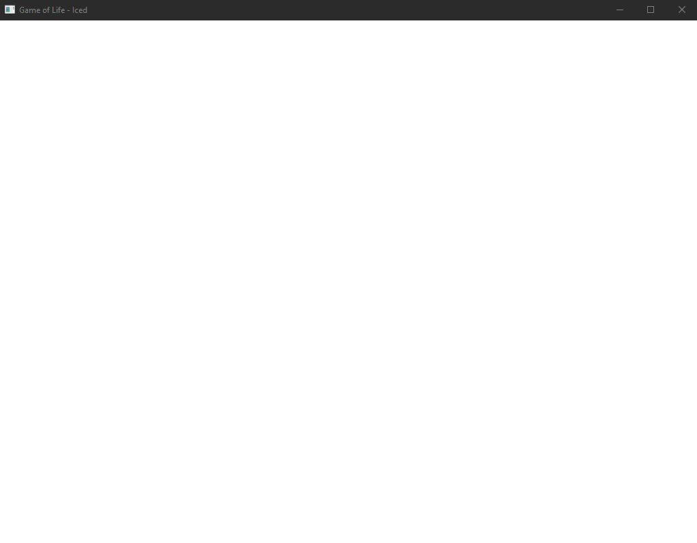
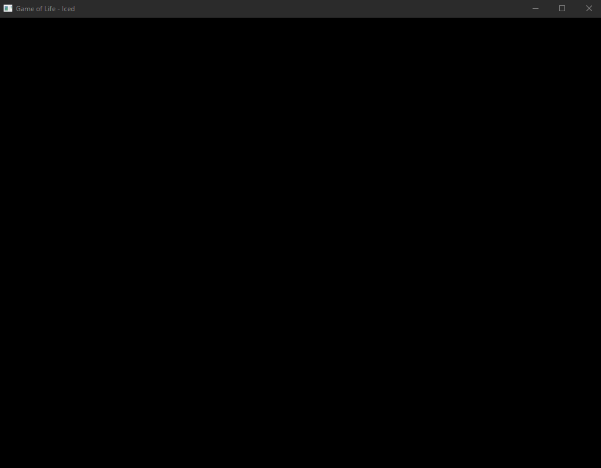
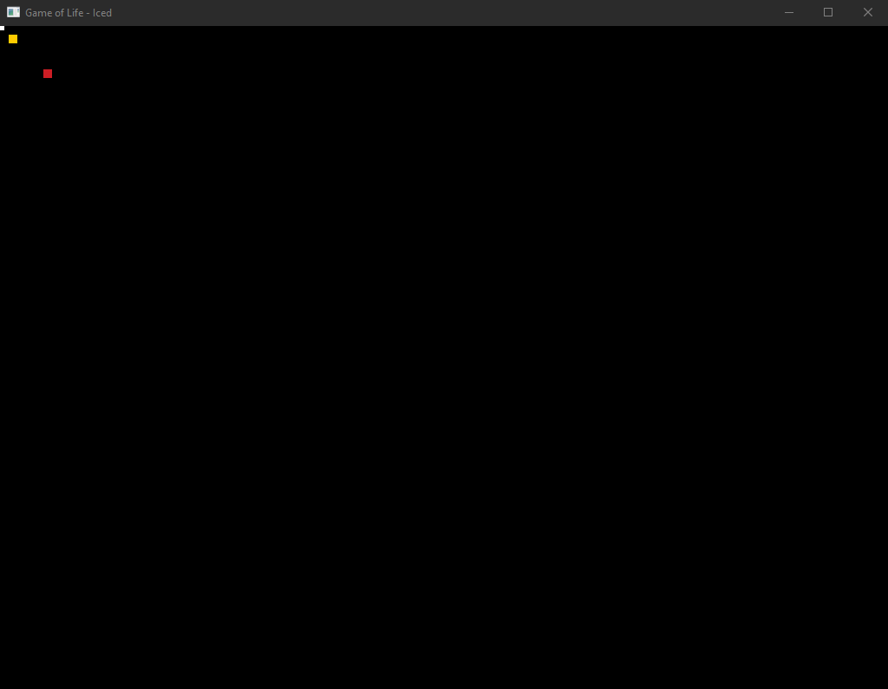
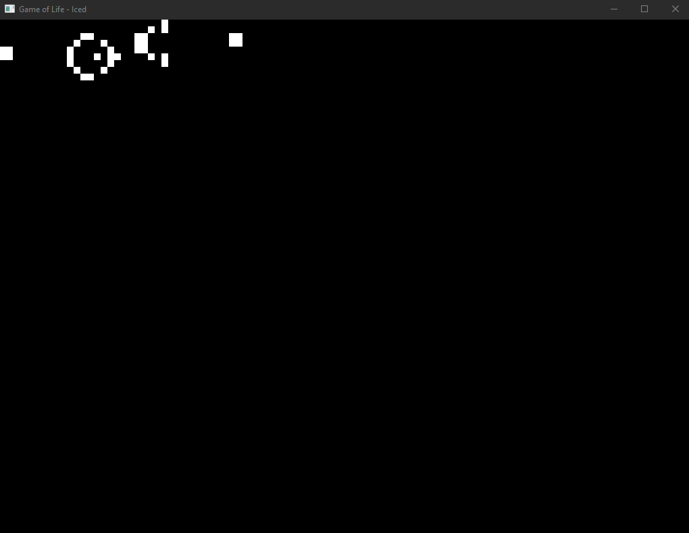
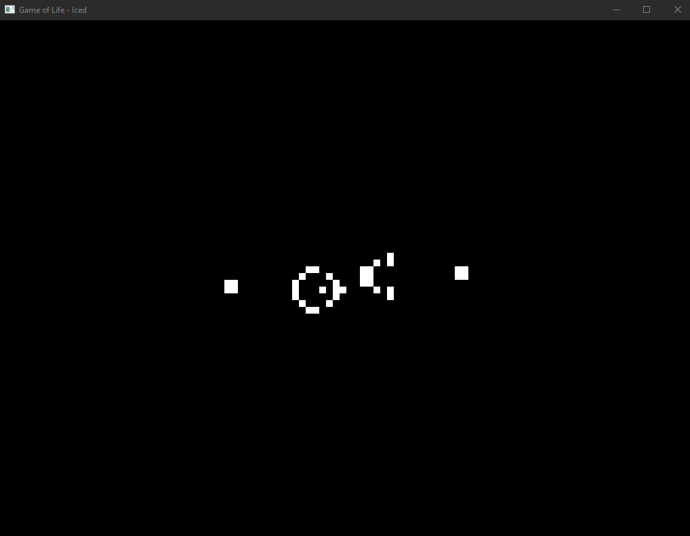
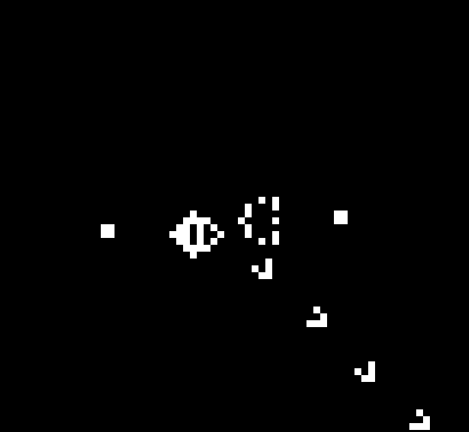

# El juego de la vida usando Rust y Iced
El [juego de la vida](https://es.wikipedia.org/wiki/Juego_de_la_vida) es un autómata celular diseñado por John Horton Conway en 1970. Presenta fenómenos emergentes y auto-organización, es decir, presenta patrones complejos a partir de reglas muy sencillas. El juego es un juego de cero jugadores, y su evolución está determinada por el estado inicial. 

El tablero es una malla regular cuadrada infinita. Todas las celdas tienen 8 células "vecinas", que son las que están próximas a ella, incluidas las diagonales. Las células pueden tener dos estados: "vivas" o "muertas". El estado de las células evoluciona en unidades de tiempo discretas. Todas las células se actualizan al mismo tiempo siguiendo estas reglas:

- Una célula muerta con exactamente 3 células vecinas vivas "nace" (el siguiente turno estará viva).
- Una célula viva con 2 o 3 células vecinas vivas sigue viva, en cualquier otro caso muere (por "soledad" o "sobrepoblación").

Este es un documento en donde se describe como se va implementando el juego de la vida en Rust utilizando el crate [Iced](https://github.com/hecrj/iced) y siguiendo el [ejemplo del juego de la vida](https://github.com/hecrj/iced/tree/master/examples/game_of_life) que se encuentra en el repositorio del crate. El código no es mío, es el mismo que viene en el ejemplo. Sin embargo este documento es relevante para desmenuzar todas las partes del código y explicar como se conforma una aplicación con esa complejidad. Puede ser que hay partes que no entiendo del todo, si notas que faltaría explicar algo a detalle en este documento o que algo está mal explicado hazmelo saber.

## Iniciar el proyecto
La aplicación la construiremos en un proyecto de Rust, para iniciarlo hacemos lo usual, en la terminal ejecutamos `cargo new GameOfLife`. Esto creará la estructura de archivos y directorios necesaria para nuestro proyecto. 

## Dependencias
Las dependencias que se usarán son principalmente iced, tokio, itertools y rustc-hash. Para usarlas basta con agregarlas en el archivo Cargo.toml en la parte de dependencias del proyecto
~~~toml
[dependencies]
iced = { version = "0.2", features = ["canvas", "tokio", "debug"] }
tokio = { version = "1.0", features = ["sync"]}
itertools = "0.10"
rustc-hash = "1.1"
rand = "0.8"
~~~

## Iced
Iced es un crate de Rust que permite generar interfaces de usuario gráficas o GUIs multiplataforma. Iced está inspirado en la [arquitectura de aplicaciones de Elm](https://guide.elm-lang.org/architecture/). Se utilizan 4 conceptos básicos:
- State: Codifica el *Estado* de nuestra aplicación.
- Messages: *Mensajes* que nos permiten evolucionar el *Estado* de nuestra aplicación.
- View logic: Controla el tipo de *Elementos* que muestra nuestra aplicación, estos *Elementos* producen *Mensajes* que cambian el *Estado* de nuestra aplicación.
- Update logic: Controla la manera en la que los *Mensajes* afectan el *Estado* de nuestra aplicación.

Iced utiliza uno de dos `traits` para implementar las aplicaciones, **Sandbox** y **Application**. **Sandbox** ofrece una interfaz simple, en la cual no es posible ejecutar acciones asíncronas. **Application** es la manera usual de implementar aplicaciones complejas pues permite controlar acciones asíncronas. Este trait es la parte principal de Iced. Para ejecutar una aplicación de Iced se utiliza el método asociado `Run` del trait. 

La manera usual de crear una aplicación de Iced es crear una `struct` en la cual se codificará el estado de nuestro sistema e implementar el `trait` **Application** en ella.  

## Estructura principal de la aplicación
En nuestra aplicación manejaremos el estado del sistema con la `struct` `GameOfLife`, por ahora la crearemos vacía en el archivo `main.rs` en la carpeta `src`. Le agregamos el trait `Default` para que inicializar las estructuras de datos que contendrá en el futuro sea más fácil.

~~~rust
#[derive(Default)]
struct GameOfLife {
    
}
~~~

Sobres esta `struct` necesitamos implementar el trait `Application`. 

Este trait tiene 3 `types` asociados:
- **Executor**: Que se encarga de ejecutar los comandos y las suscripciones. Usualmente se utiliza el **Executor** default.

- **Message**: Son los mensajes que la aplicación producirá y usará para cambiar su estado interno de acuerdo a eventos o situaciones que sucedan en el sistema. Usualmente se crea un `enum` con la información y los tipos de mensajes que vayamos necesitando. Los mensajes pueden ser producidos por interacción del usuario, por eventos y condiciones en el sistema y por `Commands`.

- **Flags**: Datos necesarios para inicializar nuestra aplicación. Usualmente se usa una `tuple` vacía.

Crearemos una `enum` encargada de codificar los mensajes de nuestra aplicación, por el momento estará vacía

~~~rust
#[derive(Debug)]
enum Message {

}
~~~

Además el trait tiene 4 métodos requeridos:
- **new**: Se encarga de inicializar la aplicación. Utiliza **Flags** como parámetros. Regresa una instancia de la `struct` y un `Command` que puede ser utilizado para realizar acciones asíncronas al inicio de la aplicación. 

- **title**: Regresa el título de nuestra aplicación. 

- **update**: Utiliza como parámetro un **Message** y actualiza el estado de la aplicación. En este método se define la lógica de actualización de la aplicación. Este método se encarga de manejar todos los mensajes del sistema. Regresa un `Command` que será ejecutado de forma inmediata.

- **view**: Regresa los **Elementos** que se mostrarán en la aplicación. Estos **Elementos** son capaces de producir mensajes de acuerdo a la interacción del usuario.

Los `Command` regresados por algunos de estos métodos son colecciones de operaciones asíncronas. Pueden ser `Commands` nulos o vacíos, generados con `Command::none()`.

Implementemos el trait **Application** a nuestra `struct`, para ello necesitamos traer al ámbito de nuestra aplicación algunas cosas necesarias:

~~~rust
use iced::{
        Application, 
        executor, 
        Command, 
        Element, 
        Container,
        Length,
        Column,
    };
~~~

e implementar los tipos y métodos necesarios para el trait:

~~~rust
impl Application for GameOfLife {
    type Message = Message;
    type Executor = executor::Default;
    type Flags = ();

    fn new(_flags: ()) -> (Self, Command<Message>) {
        (
            Self {
                ..Self::default()
            },
            Command::none()
        )
    }

    fn title(&self) -> String {
        String::from("Game of Life - Iced")
    }

    fn update(&mut self, _message: Message) -> Command<Message> {

        Command::none()
    }

    fn view(&mut self) -> Element<Message> {

        let content = Column::new();

        Container::new(content)
            .width(Length::Fill)
            .height(Length::Fill)
            .into()
    }
}
~~~

Para los `types` requeridos hemos utilizado como definición de **Message** la `enum` que creamos, como definición de **Flags** una `tuple` vacía y como definición de **Executor** la definición default provista por Iced.

Con respecto a los métodos requeridos, el método **new** no hace nada más que regresarnos una instancia de nuestra `struct GameOfLife`, regresaremos en ella la versión default de la estructura. Además regresa un `Command` vacío. El método **title** lo hemos utilizado para regresar el título de nuestra aplicación. El método **update** por el momento está vacío y solo regresa un `Command` vacío. Por último, en el método **view** hemos definido `content` como un elemento de columna de Iced y hemos agregado esta columna a un contenedor para el cual hemos ajustado sus dimensiones para que ocupen todo el espacio posible a lo alto y a lo ancho de nuestra ventana.

Nuestra `struct GameOfLife` satisface los requerimientos para el trait `Application`. Ahora podemos ejecutar esta estructura en nuestro código principal usando el método `run` del trait `Application`.

~~~rust
pub fn main() -> iced::Result {

    GameOfLife::run(Settings {
        antialiasing: true,
        ..Settings::default()
    })

}
~~~

Hemos cambiado el tipo que regresa la función main a un Result de Iced y dentro de la función se ejecutará el método `run` de `GameOfLife`. Esta función tomará el control de nuestra aplicación y no lo regresará a menos de que exista un error o se cierre el programa. 

La función `run` recibe como parámetros una `struct` de Iced de tipo `iced::settings::Settings` con ella podemos controlar los settings de nuestra aplicación, las propiedades de la ventana que se usará, el tipo de letra, el tamaño de letra y si requeriremos que nuestra aplicación realice antialiasing en algunos de los elementos que dibujará (el antialiasing mejora mucho el aspecto gráfico de algunos elementos, principalmente del canvas, pero tiene un costo en el performance). En este caso solamente activaremos el antialiasing y el resto de settings se las dejaremos al Default de Iced. Es importante agregar `Settings` al ámbito de nuestra aplicación:

~~~rust
use iced::{
        Application, 
        executor, 
        Command, 
        Element, 
        Container,
        Length,
        Column,
        Settings,
    };
~~~

Con lo que hemos creado hasta ahora tenemos la estructura básica de una aplicación usando Iced. En tu terminal ejecuta `cargo run`, espera a que compile tu programa (puede tardar algo la primera vez debido a que se compilan todas las dependencias) y disfruta de una hermosa ventana vacía:

## Dibujando el fondo del grid

Para poder representar las celdas del juego de la vida necesitamos un lugar donde sean dibujadas. Para eso utilizaremos un **Elemento** de tipo `Canvas`. `Canvas` es un elemento que es capaz de dibujar gráficas en 2 dimensiones. La manera usual de utilizar el canvas en Iced es definiendo la estructura de datos con la que vamos a dibujar, implementando en ella el trait `Program` el cual requiere la función `draw()` que manejará toda la lógica para dibujar nuestros elementos gráficos usando los datos de nuestra estrcutura de datos y luego agregar un Elemento de tipo `Canvas` a traves de su función `new()` alimentandola con la estructura de datos.

Dentro del canvas se pueden dibujar geometrías, usualmente se guardan en un `Cache` que evita que se recalculen. Un `Cache` no redibujará sus geometrías a menos que las dimensiones de sus capaz cambien o que se limpie de forma explicita.

En la sección anterior creamos la `struct GameOfLife`, esta estructura se encarga de tener control sobre el estado de todo el sistema. Agregaremos un elemento a esta estructura, a este elemento lo llamaremos Grid y será otra estructura que será encargada de controlar el estado de nuestra grid.

~~~rust
#[derive(Default)]
struct GameOfLife {
    grid: Grid,
}
~~~

Por supuesto tenemos que definir la `struct Grid`, por ahora solamente indicaremos que tendrá un `Cache` en el cual se almacenarán geometrías que se dibujaran en el canvas que crearemos.

~~~rust
#[derive(Default)]
struct Grid {
    life_cache: Cache,
}
~~~

Esta estructura será la encargada de controlar el estado de la grid en donde vivirá nuestro juego de la vida. Contendrá los datos necesarios para dibujar las celdas activas en el canvas. Ya que se encargará de dibujar es necesario que se implemente en ella el trait `Program`. El trait requiere que implementemos la función `draw()` la cual se encarga de producir las geometrías que se dibujarán en el canvas. En la función que implementaremos usaremos el Cache de nuestra estructura y su propia función `draw` para crear un `Frame` sobre el cual dibujaremos un rectangulo que ocupará todo el espacio disponible y que rellenaremos de color negro. Este rectángulo será el fondo de nuestra grid.

~~~rust
impl<Message> canvas::Program<Message> for Grid {

    fn draw(&self, bounds: Rectangle, _cursor: Cursor) -> Vec<Geometry> {

        let grid = self.life_cache.draw(bounds.size(), |frame| {
            let background = Path::rectangle(Point::ORIGIN, frame.size());

            frame.fill(&background, Color::BLACK);
        });

        vec![grid]

    }
}
~~~

Ya que el trait `Program` está implementado en la `struct Grid` podemos crear un `canvas` y agregarlo a nuestra interfaz. Para ello modificaremos nuestra función `view`. En ella definimos un `canvas` nuevo, le pasamos la estructura que satisface el trait `Program`, definimos algunas propiedades como sus dimensiones, lo agregamos a nuestra columna de contenido y listo.

~~~rust
    fn view(&mut self) -> Element<Message> {

        let canvas: Element<Message> = Canvas::new(&mut self.grid)
                    .width(Length::Fill)
                    .height(Length::Fill)
                    .into();

        let content = Column::new().push(canvas);

        Container::new(content)
            .width(Length::Fill)
            .height(Length::Fill)
            .into()
    }
~~~

En el código que escribimos en esta parte fueron necesarias partes del crate Iced que no habíamos declarado que usaríamos, necesitamos actualizar nuestro uso del crate Iced.

~~~rust
use iced::{
    Application, 
    executor, 
    Command, 
    Element, 
    Container,
    Length,
    Column,
    Settings,
    Rectangle,
    Point,
    Color,
    };
use iced::canvas::{
    self,
    Cache,
    Canvas,
    Cursor,
    Geometry,
    Path,
};
~~~

Si compilamos y ejecutamos nuestro programa con `cargo run` en la terminal obtendremos una ventana con un `canvas` que dentro tiene un rectangulo que lo abarca todo y que es de color negro.

## Dibujando celdas

Las celdas vivas de nuestro juego de la vida serán representadas por cuadros de color. Pintemos algunos cuadros para entender como funciona. Los pintaremos en el mismo Cache que utilizamos para el fondo y de hecho usaremos el mismo frame. Dentro del closure agreguemos la definición de un cuadrado colocado en la posición (50.0,50.0) y de dimensiones (10.0,10.0). Las coordenadas de nuestro canvas empiezan en la esquina superior izquierda, ahí se encuentra el (0,0). Hacia el lado derecho corre la coordenada x positiva y hacia abajo corre la coordenada y positiva.

~~~rust
impl<Message> canvas::Program<Message> for Grid {

    fn draw(&self, bounds: Rectangle, _cursor: Cursor) -> Vec<Geometry> {

        let grid = self.life_cache.draw(bounds.size(), |frame| {
            let background = Path::rectangle(Point::ORIGIN, frame.size());

            frame.fill(&background, Color::BLACK);

            frame.fill_rectangle(
                Point::new(50.0,50.0),
                Size::new(10.0,10.0),
                Color::from_rgb8(255,203,0),
            );

        });

        vec![grid]

    }
}
~~~

De esta manera podríamos pintar las celdas que queramos en la posición que sea necesario. Para poder dibujar una celda son necesarias las coordenadas donde pintarla y el tamaño, sin embargo manejar la lógica del juego de la vida en las unidades de nuestro canvas (pixeles) puede ser complicado. Necesitamos reescalar nuestras celdas de tal manera que podamos definir su posición en términos de sus coordenadas en el grid, consideraremos que el grid es una matriz infinita y que cada celda está definida por dos números, su fila y su columna. 

Iced nos permite realizar transformaciones sobre un frame y definir sobre la transformación un nuevo frame o marco de referencia. Las transformaciones que podemos aplicar son:
- trasladar
- rotar
- escalar

Ya que queremos hacer nuestras celdas más grandes que un pixel la transformación que usaremos será escalar y obtener un nuevo frame reescalado. Iced proporciona el método `with_save()` para los frames con el cual podemos aplicar una transformación sobre un frame y recordar el marco de referencia en el que estabamos. Al aplicar esta función sobre un frame obtendremos un nuevo marco de referencia montado en el anterior y un nuevo closure en el cual podremos pintar elementos.

Agreguemos un nuevo marco de referencia, reescalémoslo en 10 unidades y pintemos sobre el un par de celdas nuevas.

~~~rust
impl<Message> canvas::Program<Message> for Grid {

    fn draw(&self, bounds: Rectangle, _cursor: Cursor) -> Vec<Geometry> {

        let grid = self.life_cache.draw(bounds.size(), |frame| {
            let background = Path::rectangle(
                Point::ORIGIN, 
                frame.size()
            );

            frame.fill(&background, Color::BLACK);

            frame.with_save(|frame| {

                frame.scale(10.0);

                frame.fill_rectangle(
                    Point::new(-0.5,-0.5),
                    Size::UNIT,
                    Color::WHITE
                );

                frame.fill_rectangle(
                    Point::new(1.0,1.0),
                    Size::UNIT,
                    Color::from_rgb8(255,203,0),
                );
            });

            frame.fill_rectangle(
                Point::new(50.0,50.0),
                Size::new(10.0,10.0),
                Color::from_rgb8(205,30,37),
            );

        });

        vec![grid]

    }
}
~~~

Las dos celdas nuevas que hemos agregado viven en el marco de referencia reescalado. En este marco de referencia una unidad equivale a 10 pixeles. El orígen se mantiene en la misma posición, la esquina superior izquierda de nuestro canvas. Los cuadros que dibujamos tienen longitud de una unidad, es decir, 10 pixeles. Además hemos colocado uno de ellos en coordenadas negativas para que se pueda apreciar que nuestros marcos de referencia no están limitados a la parte visible del canvas y que ningún error ocurre si usamos coordenadas fuera de esta parte visible.

Actualizamos el ámbito de nuestro programa para indicar el uso de partes de Iced nuevas

~~~rust
use iced::{
    Application, 
    executor, 
    Command, 
    Element, 
    Container,
    Length,
    Column,
    Settings,
    Rectangle,
    Point,
    Color,
    Size,
    };
use iced::canvas::{
    self,
    Cache,
    Canvas,
    Cursor,
    Geometry,
    Path,
};
~~~

Al compilar y ejecutar tendremos nuestra interfaz con fondo negro y 3 cuadros, 2 de ellos sobre el marco referencial escalado y uno de ellos sobre el marco referencial original, podemos identificarlos por los colores. Blanco y amarillo en el marco referencial reescalado y rojo en el marco referencial original. Los tres cuadros son del mismo tamaño, pero el blanco lo vemos más pequeñom porque 3 cuartas partes de el están fuera de la parte visible de nuestro canvas.

## Implementando las celdas activas

Ya que nuestro canvas es capaz de representar celdas, necesitamos implementar la lógica de las celdas activas en el grid. Las células vívas de nuestro grid y las reglas de interacción y dinámica las colocaremos en una `struct` que llamaremos `Life` y que será parte de nuestra `struct Grid`. A su vez, la `struct Life` contendrá células vivas que representaremos por un `HashSet` de una `struct` más básica que llamaremos `Cell` y que contendrá como datos la posición en el grid de cada célula.

Comencemos por implementar la `struct Life` como parte de la `struct Grid` y la `struct Cell`. 

Modificamos `Grid` para incluir la `struct Life`,

~~~rust
struct Grid {
    life_cache: Cache,
    life: Life,
}
~~~

definimos `Life`

~~~rust
#[derive(Default)]
struct Life {
    cells: HashSet<Cell>
}
~~~

y actualizamos nuestro programa para poder usar HashSet

~~~rust
use std::collections::HashSet;
~~~

Después definimos `Cell`

~~~rust
#[derive(Hash)]
struct Cell {
    i: isize,
    j: isize,
}
~~~

En Cell implementaremos el tamaño de una celda que hardcodeamos en la función view pero que es una propiedad de la celda.

~~~rust
impl Cell {
    const SIZE: usize = 10;
}
~~~

Nuestro Grid aún no tiene celdas activas, pero en el futuro las tendrá, y las tendrá almacenadas en un HashSet. Por cada una de las celdas en el HashSet pintaremos un cuadro en el canvas. Para esto necesitamos modificar nuestra función `view`. Primero cambiaremos el valor con el cual se escala el marco de referencia al tamaño de la celda. Dentro del marco de referencia escalado incluiremos un ciclo sobre el HashSet que se encargará de dibujar cada rectangulo de la misma manera en la que lo hicimos con los rectangulos anteriores (esos rectangulos solo eran de prueba para entender como dibujar, podemos quitarlos).

~~~rust
impl<Message> canvas::Program<Message> for Grid {

    fn draw(&self, bounds: Rectangle, _cursor: Cursor) -> Vec<Geometry> {

        let grid = self.life_cache.draw(bounds.size(), |frame| {
            let background = Path::rectangle(
                                        Point::ORIGIN, 
                                        frame.size()
                                    );

            frame.fill(&background, Color::BLACK);

            frame.with_save(|frame| {

                frame.scale(Cell::SIZE as f32);

                for cell in &self.life.cells {

                    frame.fill_rectangle(
                        Point::new(cell.j as f32, cell.i as f32),
                        Size::UNIT,
                        Color::WHITE,
                    )

                }

            });

        });

        vec![grid]

    }
}
~~~

## Definiendo estructuras de celdas predefinidas

Nuestra función `view` ya es capaz de dibujar las celdas que se encuentren activas dentro de nuestro grid. Sin embargo, nuestro grid está vacío. Hasta ahora, todas las `struct` que hemos definido se inicializan con valores por Default derivando el `trait` Default para ellas. Sin embargo, esto hace que nuestro grid se inicialice sin celdas activas. Necesitamos definir el valor por Default de nuestro grid con el cual se iniciará nuestro grid. Para ello definiremos algunas estructuras de celdas activas predefinidas.

Nuestras estructuras predefinidas las implementaremos en un `enum`. Por ahora incluiremos dos, un Glider y un GliderGun. El código original de este ejemplo tiene algunas estructuras más con las cuales jugar.

~~~rust
enum Preset {
    Glider,
    GliderGun,
}
~~~

Sobre esta `enum` implementaremos una función que de acuerdo a la estructura que usemos crea un vector de tuplas con las coordenadas en el grid de cada una de las celdas que conforman la estructura, `Vec<(isize, isize)>`. Esta función se encarga de parsear un esquema de celdas activas conformado por "x"s a tuplas con coordenadas para estas celdas activas. En el match en su interior deberían estar los esquemas de cada una de las estructuras predefinidas del `enum Preset`.

~~~rust
impl Preset {
    pub fn life(self) -> Vec<(isize, isize)> {

        #[rustfmt::skip]
        let cells = match self {
            Preset::Glider => vec![
                " x ",
                "  x",
                "xxx"
            ],
            Preset::GliderGun => vec![
                "                        x           ",
                "                      x x           ",
                "            xx      xx            xx",
                "           x   x    xx            xx",
                "xx        x     x   xx              ",
                "xx        x   x xx    x x           ",
                "          x     x       x           ",
                "           x   x                    ",
                "            xx                      ",
            ],
        };

        cells
            .into_iter()
            .enumerate()
            .flat_map(|(i, cells)| {
                cells
                    .chars()
                    .enumerate()
                    .filter(|(_, c)| !c.is_whitespace())
                    .map(move |(j, _)| {
                        (i as isize, j as isize)
                    })
            }).collect()
    }
}
~~~

Además definiremos el comportamiento por default de la `enum Preset` implementando el `trait Default` en ella.

~~~rust
impl Default for Preset {
    fn default() -> Preset {
        Preset::Glider
    }
}
~~~

Una vez que nuestros presets están definidos necesitamos implementar una función sobre la `struct Grid` que nos permita construir una instancia de ella a partir de uno de nuestros presets. Esta función llamará la función `life()` del preset a usar, convertirá el vector de tuplas de coordenadas que regresa la función en un iterador y construirá, para cada una de las tuplas una `struct Cell`. Recolectaremos estas celdas en una `struct Life` que suaremos como valor para el campo `life` de la `struct Grid` a crear. La `struct Grid` también necesita un valor para el campo `life_cache`, usaremos el valor por default del cache de Iced. La función se muestra a continuación, sin embargo falta un detalle para que compile 

~~~rust
impl Grid {
    pub fn from_preset(preset: Preset) -> Self {
        Self {
            life: preset.life()
                    .into_iter()
                    .map(|(i,j)| Cell { i, j })
                    .collect(),
            life_cache: Cache::default(),
        }
    }
}
~~~

La función no compila porque es imposible recolectar una `struct Life` a partir de un iterador. Para que sea posible recolectar el iterador en una `struct Life` es necesario implementar el trait `std::iter::FromIterator<Cell>` para nuestra `struct Life`. Para implementarlo necesitamos que los items del iterador, en este caso son `struct Cell` implementen a su vez el trait `Eq` y el trait `PartialEq`. que podemos derivar sobre la `struct Cell` agregandolos en los traits que ya se están derivando

~~~rust
#[derive(PartialEq, Eq, Hash)]
struct Cell {
    i: isize,
    j: isize,
}
~~~

Una vez que `struct Cell` satisface los requerimientos necesarios, podemos implementar el `trait FromIterator<Cell>` en `Life`. Para esto necesitamos implementar la función `from_iter` 

~~~rust
impl std::iter::FromIterator<Cell> for Life {
    fn from_iter<I: IntoIterator<Item = Cell>>(iter: I) -> Self {
        Life {
            cells: iter.into_iter().collect(),
        }
    }
}
~~~

Una vez implementado el trait nuestra función `from_preset` puede recolectar sin problemas una `struct Life` a partir de un iterador de `Cell`s y por lo tanto construir una `struct Grid`. Con esto podemos usar la función para definir el comportamiento default de la `struct Grid` implementando el `trait Default`. Como comportamiento default se creará un grid a partir del preset `Preset::GliderGun` (si quieres cambiar la estructura predefinida con la que se inicializa el grid puedes cambiarlo aquí a Glider o implementar alguna otra, ponerle un nombre y inicializarla desde aquí).

~~~rust
impl Default for Grid {
    fn default() -> Self {
        Self::from_preset(Preset::GliderGun)
    }
}
~~~

Para que nuestra implementación del `trait Default` no conflictue con el `trait Default` que habíamos derivado para la `struct Grid` necesitamos borrar la línea donde lo derivábamos. La definición de la `struct Grid` queda así

~~~rust
//Eliminamos la línea que estaba aquí... #[derive(Default)]
struct Grid {
    life_cache: Cache,
    life: Life,
}
~~~

Después de compilar y ejecutar con `cargo run` deberías ver una ventana con un grid que contiene celulas activas en aquellos lugares en donde el esquema de la estructura predefinida estaba marcado con una "x"

## Centrando la estructura predefinida

Usualmente la dinámica del juego de la vida se dirije hacia todos lados, de tal manera que iniciar nuestra estructura en la esquina no es lo más conveniente pues nos perderíamos toda la dinámica que viaja hacia la parte superior izquierda. Podemos desplazar el origen de nuestro frame aplicando otra transformación. En este caso será una traslación. Para ello necesitamos definir cual va a ser el nuevo orígen de nuestro marco de referencia y aplicar nuestra transformación.

Agregando este par de cambios nuestra función `draw` queda de la siguiente manera

~~~rust
impl<Message> canvas::Program<Message> for Grid {

    fn draw(&self, bounds: Rectangle, _cursor: Cursor) -> Vec<Geometry> {

        //En esta línea definimos el nuevo orígen del frame
        let center = Vector::new(bounds.width / 2.0, bounds.height / 2.0);

        let grid = self.life_cache.draw(bounds.size(), |frame| {
            let background = Path::rectangle(Point::ORIGIN, frame.size());

            frame.fill(&background, Color::BLACK);

            frame.with_save(|frame| {

                //En esta linea aplicamos la transformación
                frame.translate(center);
                frame.scale(Cell::SIZE as f32);

                for cell in &self.life.cells {

                    frame.fill_rectangle(
                        Point::new(cell.j as f32, cell.i as f32),
                        Size::UNIT,
                        Color::WHITE,
                    )

                }

            });

        });

        vec![grid]

    }
}
~~~

Además necesitamos modificar la función `life` de la `enum Preset` para que las tuplas de coordenadas que regresa estén centradas en el origen y no desplazadas a la parte positiva, positiva del marco referencial. Para ello definiremos una columna y una fila iniciales que están desplazadas justo por la mitad de las dimensiones de nuestra estructura predefinida y le agregaremos estos valores a las coordenadas en la tupla.

~~~rust
impl Preset {
    pub fn life(self) -> Vec<(isize, isize)> {

        #[rustfmt::skip]
        let cells = match self {
            Preset::Glider => vec![
                " x ",
                "  x",
                "xxx"
            ],
            Preset::GliderGun => vec![
                "                        x           ",
                "                      x x           ",
                "            xx      xx            xx",
                "           x   x    xx            xx",
                "xx        x     x   xx              ",
                "xx        x   x xx    x x           ",
                "          x     x       x           ",
                "           x   x                    ",
                "            xx                      ",
            ],
        };

        //Calculamos la fila inicial
        let start_row = -(cells.len() as isize / 2);

        cells
            .into_iter()
            .enumerate()
            .flat_map(|(i, cells)| {

                //Calculamos la columna inicial
                let start_column = -(cells.len() as isize / 2);

                cells
                    .chars()
                    .enumerate()
                    .filter(|(_, c)| !c.is_whitespace())
                    .map(move |(j, _)| {
                        //Agregamos los valores a las coordenadas
                        (start_row + i as isize, start_column + j as isize)
                    })
            }).collect()
    }
}
~~~

Además necesitamos agregar al ámbito de nuestra aplicación el uso de `Vector`

~~~rust
use std::collections::HashSet;
use iced::{
    Application, 
    executor, 
    Command, 
    Element, 
    Container,
    Length,
    Column,
    Settings,
    Rectangle,
    Point,
    Color,
    Size,
    Vector,
    };
use iced::canvas::{
    self,
    Cache,
    Canvas,
    Cursor,
    Geometry,
    Path,
};
~~~

Compilando y ejecutando tendremos nuestra ventana con la estructura predefinida bien centrada

## Dinámica del juego de la vida

Hasta ahora hemos logrado pintar celdas vivas en nuestro canvas. Necesitamos implementar la evolución del juego de la vida. Esta evolución está determinada por las reglas:

- Una célula muerta con exactamente 3 células vecinas vivas "nace" (el siguiente turno estará viva).
- Una célula viva con 2 o 3 células vecinas vivas sigue viva, en cualquier otro caso muere (por "soledad" o "sobrepoblación").

Ambas reglas dependen solamente de la vecindad de una celda, es decir, el estado de una celda solamente depende de el estado de sus vecinos. Definiremos dentro de la `struct Cell` métodos que permitirán saber cual es la vecindad de una celda. Definiremos dos métodos, uno que nos indicará las celdas que pertenecen al cluster de nuestra célula (ella más sus vecinas) y otro que filtrará a solamente aquellas celdas que sean vecinas. Ambas funciones regresarán iteradores sobre los conjuntos.

~~~rust
impl Cell {
    const SIZE: usize = 10;

    fn cluster(cell: Cell) -> impl Iterator<Item = Cell> {
        use itertools::Itertools;

        let rows = cell.i.saturating_sub(1) ..= cell.i.saturating_add(1);
        let columns = cell.j.saturating_sub(1) ..= cell.j.saturating_add(1);

        rows.cartesian_product(columns).map(|(i,j)| Cell {i, j})
    }

    fn neighbors(cell: Cell) -> impl Iterator<Item = Cell> {
        Cell::cluster(cell).filter(move |candidate| *candidate != cell)
    }
}
~~~

Para que podamos mover a las celdas pertenecientes a la vecindad necesitamos que la `struct Cell` implemente los `traits` `Copy` y `Clone`, los cuales podemos derivar agregandolos a los `traits` que ya se están derivando

~~~rust
#[derive(Copy, Clone, PartialEq, Eq, Hash)]
struct Cell {
    i: isize,
    j: isize,
}
~~~

Una vez que somos capaces de saber la vecindad de una celda entonces podemos implementar en la `struct Life` la evolución de las celdas. El juego de la vida evoluciona todas las celdas del grid al mismo tiempo, es decir, en un tiempo t todo el grid cambia de estado. Las únicas celdas que tienen la posibilidad de alterar su estado son aquellas que tienen vecinos, por lo cual tenemos que iterar sobre aquellas células vivas y sus vecindades. Para cada una de las celdas potenciales a cambiar contaremos el número de vecinos vivos con los que cuenta. Después, con el número de vecinos activos determinaremos si una célula cambia de estado o permanece inalterada.

~~~rust
impl Life {
    fn tick(&mut self) {
        let mut adjacent_life: HashMap<Cell,usize> = HashMap::default();

        for cell in &self.cells {
            adjacent_life.entry(*cell).or_insert(0);

            for neighbour in Cell::neighbors(*cell) {
                let amount = adjacent_life.entry(neighbour).or_insert(0);

                *amount += 1;
            }
        }

        for (cell, amount) in adjacent_life.iter() {
            match amount {
                2 => {},
                3 => {
                    self.cells.insert(*cell);
                },
                _ => {
                    self.cells.remove(cell);
                }
            }
        }
    }
}
~~~

Necesitamos agregar al ámbito de nuestra aplicación el uso de `HashMap`

~~~rust
use std::collections::{HashSet,HashMap};
~~~

La función `tick` cambia el `HashSet` de `Cell`s en el campo `cells` de la `struct Life` aplicando las reglas del juego de la vida una vez, es decir `tick` avanza la evolución de nuestro grid en una unidad temporal. Recordemos que la `struct Life` es solamente una parte de `Grid`, haremos una función que se encarga de actualizar a `Grid` durante una unidad temporal. En esa unidad temporal sucederán dos cosas, su `struct Life` ejecutará la función `tick` para avanzar una unidad en el tiempo y además el Cache en donde dibujamos las células  vivas existentes, `life_cache`, se limpiará para que la función draw pueda redibujarlo de nuevo en su momento.

Agregamos al bloque `impl` de la `struct Grid` la siguiente función

~~~rust
pub fn update(&mut self) {
        self.life.tick();
        self.life_cache.clear();
}
~~~

Con esto la dinámica del juego de la vida quedá implementada. Cada que `Grid` ejecute su función `update()` la dinámica avanzará en una unidad temporal.

## Ciclo de tiempo de nuestra aplicación

Para actualizar el estado de nuestra aplicación Iced utiliza los mensajes o `Messages`, cada que la aplicación recibe un mensaje la función `update` que implementamos como parte del `trait Application` se encarga de actualizar el estado de la aplicación de acuerdo al mensaje recibido. En nuestro caso implementaremos un mensaje que se ancarga de avanzar la dinámica de `struct Grid` en una unidad temporal.

Primero agregaremos el tipo de mensaje `Tick` a nuestra `enum Message` 

~~~rust
#[derive(Debug)]
enum Message {
    Tick,
}
~~~

Después haremos que nuestra función `update()` del `trait Application` avance la dinámica de nuestra `struct Grid` cada que reciba el mensaje `Tick`, es decir, cada que reciba el mensaje `Tick` ejecutará la función `update()` de la `struct Grid`

~~~rust
fn update(&mut self, message: Message) -> Command<Message> {

        match message {
            Message::Tick => {
                self.grid.update();
            }
        }

        Command::none()
}
~~~

Ahora necesitamos hacer que de forma recurrente nuestra aplicación esté enviando mensajes de tipo `Tick` cada cierta cantidad de tiempo para que la evolución sea continua. Esto se puede lograr implementando el método `subscription()` en el `trait Application` con lo cual podemos generar una suscripción a eventos que se mantendrá viva mientras la aplicación esté corriendo. Los mensajes que produzca esta suscripción serán manejados por la función `update()` del mismo `trait`.

En el bloque de código en el cual implementamos las funciones requeridas del `trait Application` agregamos la siguiente definición del método `suscription()`

~~~rust
fn subscription(&self) -> Subscription<Message>{
        time::every(std::time::Duration::from_millis(50))
            .map(|_instant| {
                Message::Tick
             } )
}
~~~

Esta función se encargará de generar un `Message::Tick` cada 50 milisegundos. 

Actualizamos el ámbito de nuestra aplicación con algunas definiciones que usamos

~~~rust
use std::collections::{HashSet,HashMap};
use iced::{
    Application, 
    executor, 
    Command, 
    Element, 
    Container,
    Length,
    Column,
    Settings,
    Rectangle,
    Point,
    Color,
    Size,
    Vector,
    Subscription,
    time,
    };
use iced::canvas::{
    self,
    Cache,
    Canvas,
    Cursor,
    Geometry,
    Path,
};
~~~

La suscripción se encarga de enviar un mensaje de tipo `Tick` cada 50 milisegundos, el mensaje lo recibe la función `update()` que se encarga de avanzar el estado de la `struct Grid` en una unidad temporal y de borrar el cache en donde teníamos nuestras células vivas dibujadas. La función `view()` se encarga de volver a dibujar geometrías en el cache que acabamos de vaciar, esta vez con el nuevo conjunto de células vivas. El proceso se repite con cada uno de los mensajes generados.

Al compilar y ejecutar obtenemos un juego de la vida que evoluciona!

Hasta aquí hemos generado una aplicación del juego de la vida que funciona. El [ejemplo](https://github.com/hecrj/iced/tree/master/examples/game_of_life) en el repositorio original del crate Iced es más complejo pues involucra capacidades para controlar aspectos de nuestra aplicación como la velocidad. Además permite navegar por el grid y hacer zoom-in y zoom-out en el.

Poco a poco iremos incluyendo esas capacidades extras en este tutorial, por ahora puedes encontrar el código completo de esta primera versión de nuestra aplicación [aquí](https://github.com/irvingfisica/iced_examples/blob/master/examples/life01.rs).